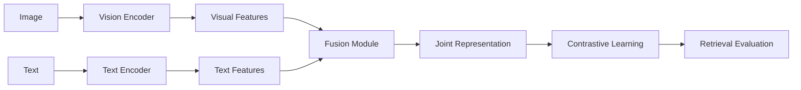
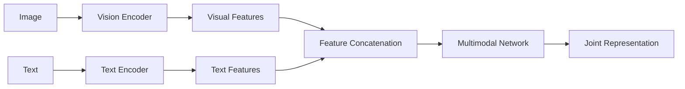
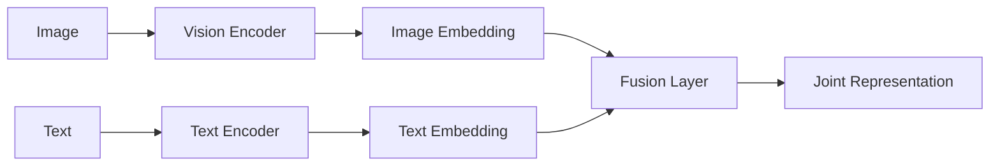
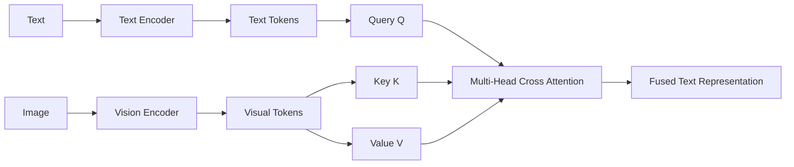

# 🔬 Vision-Language Fusion Ablation Study

<p align="center">

**A Controlled Study of Multimodal Fusion Strategies for Vision-Language Models**

<br>

[]()
[]()
[]()
[]()

</p>

---

## 📌 Overview

This project investigates how different **multimodal fusion strategies**
affect image-text representation learning in Vision-Language Models (VLMs).

We implement and compare:

- 🟦 **Early Fusion**
- 🟩 **Late Fusion**
- 🟪 **Cross-Attention Fusion**

All approaches are evaluated under a controlled experimental setup using
the same synthetic image-text dataset and a contrastive learning objective.

The primary goal is to understand **when and how visual and linguistic
information should interact inside a multimodal architecture.**

---

# 🎯 Research Question

> **How does the choice of multimodal fusion strategy affect image-text
> representation alignment and retrieval performance?**

Specifically, we investigate whether:

```text
Simple Feature Fusion
        vs
Late Representation Fusion
        vs
Dynamic Token-Level Interaction
```

leads to different multimodal learning behavior.

---

# 🧠 Core Idea

The overall system can be represented as:

```text
                    ┌──────────────────┐
                    │  Synthetic Data  │
                    └────────┬─────────┘
                             │
                    ┌────────┴────────┐
                    │                 │
                  Image             Text
                    │                 │
                    ▼                 ▼
             Vision Encoder     Text Encoder
                    │                 │
                    ▼                 ▼
             Visual Features     Text Features
                    │                 │
                    └────────┬────────┘
                             │
                      Fusion Strategy
                             │
            ┌────────────────┼────────────────┐
            │                │                │
            ▼                ▼                ▼
       Early Fusion      Late Fusion    Cross-Attention
            │                │                │
            └────────────────┼────────────────┘
                             │
                             ▼
                  Joint Representation
                             │
                             ▼
                   Contrastive Learning
                             │
                             ▼
                       Evaluation
```

---

# 🚀 Objectives

- Build a controlled Vision-Language learning environment.
- Implement multiple multimodal fusion mechanisms.
- Train the models using contrastive learning.
- Compare image-text retrieval performance.
- Analyze learned multimodal representations.
- Visualize cross-modal attention.
- Perform a controlled fusion ablation study.

---

# 🗂️ Dataset

## Synthetic Vision-Language Dataset

To isolate the effect of the fusion mechanism, the project uses a
procedurally generated dataset.

Each sample contains:

```text
Image
   +
Text Caption
```

The image consists of a simple colored geometric shape placed at a
specific spatial position.

### Dataset Attributes

| Attribute | Values |
|---|---|
| Colors | 8 |
| Shapes | 3 |
| Positions | 7 |
| Unique Samples | 168 |
| Image Size | 32 × 32 |

### Example

```text
Image:

┌────────────────┐
│                │
│                │
│ 🟥             │
│                │
│                │
└────────────────┘

Caption:

"a red square is on the left"
```

The dataset is generated automatically, ensuring exact alignment between
the image and its corresponding caption.

---

# 🏗️ Model Architecture

## Overall Architecture



---

# 🔀 Multimodal Fusion Strategies

## 1️⃣ Early Fusion

In Early Fusion, visual and textual representations are combined at an
early stage before multimodal processing.



### Concept

```text
Image → Vision Encoder ──┐
                         ├──→ Combine → Multimodal Network
Text  → Text Encoder  ───┘
```

### Key Property

The two modalities interact **early in the network**.

---

# 2️⃣ Late Fusion

In Late Fusion, each modality is independently processed and combined
only after high-level representations have been obtained.



### Concept

```text
Image → Vision Encoder → Image Embedding ──┐
                                           ├──→ Fusion
Text  → Text Encoder  → Text Embedding ────┘
```

### Key Property

The modalities remain mostly independent until the **later stage**.

---

# 3️⃣ Cross-Attention Fusion

Cross-Attention enables one modality to dynamically attend to another
modality at the token level.

In this project:

```text
Text Tokens  → Query (Q)
Image Tokens → Key (K)
Image Tokens → Value (V)
```



### Attention Equation

$$
Attention(Q,K,V)
=
softmax
\left(
\frac{QK^T}{\sqrt{d_k}}
\right)V
$$

### Key Property

Unlike simple concatenation or averaging, cross-attention allows each
text token to dynamically determine **which visual tokens are relevant**.

---

# 🔗 Contrastive Learning

The models learn a shared embedding space for images and text.

Matching image-text pairs are pulled together while mismatched pairs
are pushed apart.

```text
Positive Pair

Image₁  ─────────────── Caption₁
              ✓


Negative Pairs

Image₁  ─────────────── Caption₂
              ✗

Image₁  ─────────────── Caption₃
              ✗
```

---

## Similarity Matrix

Given normalized image embeddings $I$ and text embeddings $T$:

$$
S = \frac{IT^T}{\tau}
$$

where:

- $I$ = image embeddings
- $T$ = text embeddings
- $\tau$ = temperature parameter

For a batch of $N$ samples:

```text
             Text
          T1   T2   T3   T4

Image I1   ✓    ✗    ✗    ✗
      I2   ✗    ✓    ✗    ✗
      I3   ✗    ✗    ✓    ✗
      I4   ✗    ✗    ✗    ✓
```

---

# 📐 Contrastive Loss

The training objective uses symmetric image-to-text and text-to-image
classification losses.

$$
L =
\frac{
L_{image\rightarrow text}
+
L_{text\rightarrow image}
}{2}
$$

### Training Flow

```text
Image Batch
     │
     ▼
Vision Encoder
     │
     ▼
Image Embeddings
     │
     ├──────────────┐
     │              │
     ▼              ▼
Similarity Matrix ← Text Embeddings
     ▲              ▲
     │              │
Text Batch → Text Encoder
```

---

# 🧩 Model Variants

| Model | Vision Encoder | Text Encoder | Fusion | Objective |
|---|---|---|---|---|
| Baseline | CNN | Transformer | Independent | Contrastive |
| Early Fusion | CNN | Transformer | Early | Contrastive |
| Late Fusion | CNN | Transformer | Late | Contrastive |
| Cross-Attention | CNN | Transformer | Cross-Attention | Contrastive |

---

# ⚙️ Experimental Configuration

| Parameter | Value |
|---|---:|
| Image Size | 32 × 32 |
| Embedding Dimension | 64 |
| Attention Heads | 4 |
| Temperature | 0.07 |
| Batch Size | 32 |
| Epochs | 20 |
| Learning Rate | 3e-4 |
| Optimizer | AdamW |
| Weight Decay | 1e-4 |

All fusion strategies should be trained using comparable settings to
ensure a fair comparison.

---

# 📊 Evaluation

The models are evaluated using both quantitative and qualitative analysis.

## Quantitative Metrics

### Contrastive Loss

Measures how effectively the model separates positive and negative
image-text pairs.

### Recall@1

Percentage of queries for which the correct paired item is ranked first.

### Recall@5

Percentage of queries for which the correct paired item appears within
the top five retrieved results.

---

# 🔎 Retrieval Evaluation

## Image → Text

```text
Query Image
     │
     ▼
Image Encoder
     │
     ▼
Image Embedding
     │
     ▼
Similarity with all Text Embeddings
     │
     ▼
Top-K Captions
```

## Text → Image

```text
Query Caption
     │
     ▼
Text Encoder
     │
     ▼
Text Embedding
     │
     ▼
Similarity with all Image Embeddings
     │
     ▼
Top-K Images
```

---

# 🧪 Ablation Study

The central experiment compares how information is exchanged between
the two modalities.

| Model | Fusion | Interaction | Expected Behavior |
|---|---|---|---|
| Baseline | None | Independent | Global alignment |
| Early Fusion | Early | Feature-level | Early joint representation |
| Late Fusion | Late | High-level | Independent encoding |
| Cross-Attention | Dynamic | Token-level | Fine-grained interaction |

---

# 📈 Results

Results will be added after training and evaluating all models under the
same protocol.

## Main Results

| Model | Loss | Image→Text R@1 | Image→Text R@5 | Text→Image R@1 | Text→Image R@5 |
|---|---:|---:|---:|---:|---:|
| Baseline | TBD | TBD | TBD | TBD | TBD |
| Early Fusion | TBD | TBD | TBD | TBD | TBD |
| Late Fusion | TBD | TBD | TBD | TBD | TBD |
| Cross-Attention | TBD | TBD | TBD | TBD | TBD |

---

# 📉 Training Curves

Training loss comparison:

```text
results/
└── loss_curves/
    └── fusion_loss_comparison.png
```

Example visualization:

```text
Loss
 │
 │╲
 │ ╲       Early
 │  ╲____
 │       ╲
 │        ╲___ Cross-Attention
 │
 └──────────────────────── Epoch
```

> Replace the placeholder visualization with the actual experimental
> plot after training.

---

# 🧮 Similarity Matrix

The similarity matrix provides a visualization of image-text alignment.

```text
             Text
          T1   T2   T3   T4

Image I1  ██   ░    ░    ░
      I2  ░    ██   ░    ░
      I3  ░    ░    ██   ░
      I4  ░    ░    ░    ██
```

A stronger diagonal indicates better alignment between matching
image-text pairs.

---

# 👁️ Cross-Attention Visualization

Cross-attention weights can be visualized to understand how text tokens
attend to visual tokens.

```text
              Visual Tokens
           V1 V2 V3 V4 ... V16

Text T1     ░  ░  █  ░  ... ░
Text T2     ░  █  ░  ░  ... ░
Text T3     ░  ░  ░  █  ... ░
Text T4     ░  ░  █  ░  ... ░
```

This provides an interpretable view of **text-to-image interaction**.

---

# 💡 Research Analysis

The main analysis focuses on three questions:

### Q1. Does early interaction improve representation learning?

Compare Early Fusion against the independent baseline.

### Q2. Does late high-level fusion provide sufficient multimodal alignment?

Compare Late Fusion against Early Fusion.

### Q3. Does token-level cross-attention provide better alignment?

Compare Cross-Attention against both feature-level fusion approaches.

---

# 🔬 Key Findings

> Findings will be populated from the actual experimental results.

Potential analysis dimensions:

- Representation alignment
- Retrieval accuracy
- Training convergence
- Cross-modal interaction
- Attention interpretability
- Computational complexity

---

# ⚠️ Limitations

This is a controlled proof-of-concept rather than a large-scale VLM benchmark.

Current limitations include:

- Small synthetic dataset
- Simple geometric images
- Limited vocabulary
- No pretrained large-scale encoders
- Limited visual complexity
- Training-set retrieval can be overly easy

Therefore, results should not be directly interpreted as representative
of real-world VLM performance.

---

# 🚀 Future Work

- [ ] Complete Early Fusion implementation
- [ ] Complete Late Fusion implementation
- [ ] Train/validation/test split
- [ ] Compositional generalization experiments
- [ ] Larger synthetic datasets
- [ ] Real image-text datasets
- [ ] Pretrained vision encoder
- [ ] Pretrained language model
- [ ] Embedding dimension ablation
- [ ] Temperature ablation
- [ ] Attention-head ablation
- [ ] Computational efficiency analysis
- [ ] Scaling experiments
- [ ] Attention interpretability analysis

---

# 📁 Project Structure

```text
vlm-fusion-ablation-study/
│
├── README.md
├── PROJECT_STRUCTURE.md
├── requirements.txt
├── LICENSE
│
├── notebooks/
│   └── vlm_fusion_ablation.ipynb
│
├── src/
│   ├── dataset.py
│   ├── encoders.py
│   ├── early_fusion.py
│   ├── late_fusion.py
│   ├── cross_attention.py
│   ├── losses.py
│   └── evaluation.py
│
├── experiments/
│   ├── baseline/
│   │   ├── train.py
│   │   └── config.yaml
│   │
│   ├── early_fusion/
│   │   ├── train.py
│   │   └── config.yaml
│   │
│   ├── late_fusion/
│   │   ├── train.py
│   │   └── config.yaml
│   │
│   └── cross_attention/
│       ├── train.py
│       └── config.yaml
│
├── results/
│   ├── loss_curves/
│   ├── retrieval/
│   ├── similarity_matrices/
│   └── attention_maps/
│
└── assets/
    └── architecture.png
```

---

# 🛠️ Installation

Clone the repository:

```bash
git clone <repository-url>

cd vlm-fusion-ablation-study
```

Install dependencies:

```bash
pip install -r requirements.txt
```

---

# ▶️ Usage

Run the main notebook:

```bash
jupyter notebook
```

Then open:

```text
notebooks/vlm_fusion_ablation.ipynb
```

The notebook contains:

```text
Dataset Generation
       ↓
Tokenization
       ↓
Vision Encoder
       ↓
Text Encoder
       ↓
Fusion Models
       ↓
Contrastive Training
       ↓
Retrieval Evaluation
       ↓
Visualization
```

---

# 📦 Requirements

```text
torch
torchvision
numpy
Pillow
matplotlib
```

---

# 🔁 Reproducibility

For reproducible experiments, record:

- Random seed
- Python version
- PyTorch version
- GPU
- Dataset configuration
- Model configuration
- Learning rate
- Batch size
- Number of epochs

---

# 📚 References

### Core Papers

1. **Attention Is All You Need**
   - Vaswani et al.
   - Transformer architecture

2. **Learning Transferable Visual Models From Natural Language Supervision**
   - Radford et al.
   - CLIP and contrastive vision-language learning

3. **An Image is Worth 16x16 Words**
   - Dosovitskiy et al.
   - Vision Transformer

4. Relevant research on:
   - Vision-Language Models
   - Multimodal Fusion
   - Cross-Attention
   - Contrastive Learning

---

# 👨‍💻 Author

**Abhishek Singh**

Research interests:

```text
Speech AI
ASR
Large Language Models
Vision-Language Models
Multimodal AI
Representation Learning
```

---

# ⭐ Project Philosophy

> **Same data. Same objective. Different fusion mechanism.**

The purpose of this project is not simply to build a VLM, but to
systematically understand how **multimodal information exchange**
influences representation learning.

---

<p align="center">

### 🔬 Vision × Language × Fusion

**A controlled study of multimodal representation learning.**

</p>
